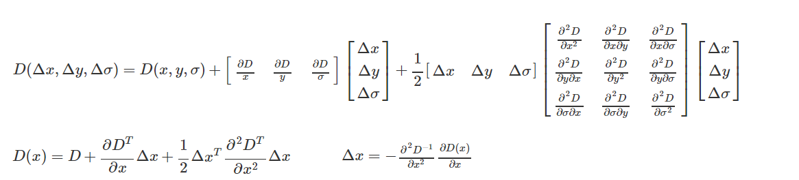
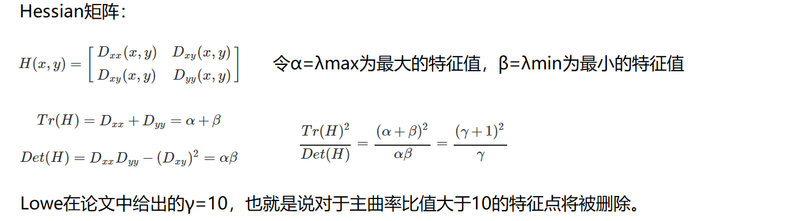
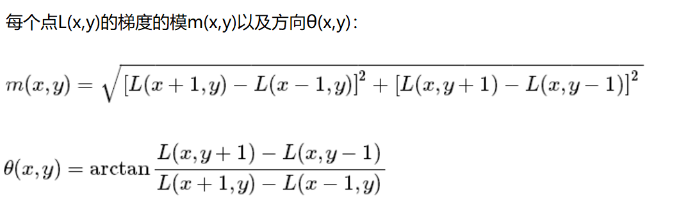
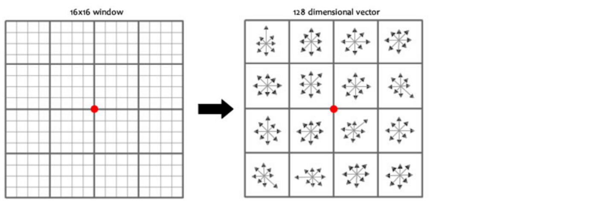
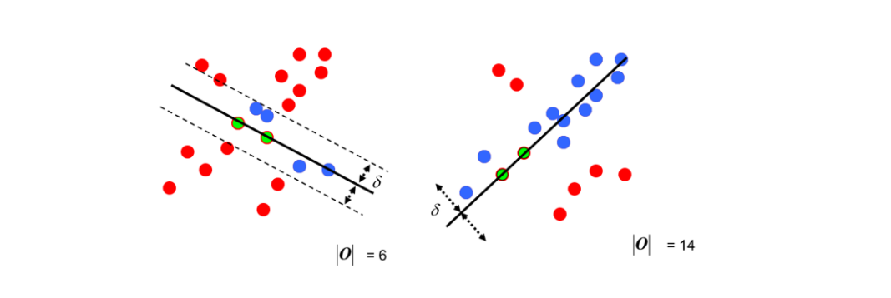
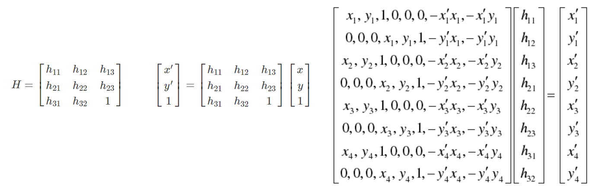

# 图像拼接

## 1. 图像特征 SIFT

### 1. 图像尺度空间

#### 1. 就是考虑图像在不同的尺度下都存在的特征点

#### 2. 使用高斯滤波制造不同模糊程度的图片，看作不同尺度下的图片

#### 3. 高斯差分金字塔

* 多分辨率金字塔中，每层都有都有多个不同的高斯滤波变换这里假设有5张，1，2，3，4，5

* 高斯差分金字塔DOG：

  * 1-2，2-3，3-4，4-5 ，每个都是差异性结果，总共这个四层组成一个DOG
  * 公式：G高斯滤波器，I 原始图像

  

  * 寻找极值点，某个点需要和定义窗口内的点，以及上一层下一层对应窗口点比较 

  * 使用泰勒级数进行展开，找到更准确地极值点，即关键点精确定位

    

  * 消除边界响应

    也就是 a/p ＞10  删除

    

  * 特征点的主方向: 每个点L的梯度的模，以及方向

    

    每个特征点这样就得到了三个信息位置（x,y），尺度，方向，具有多个方向的关键点可以被赋值为多份

  #### 4. 生成特征描述

  * 在完成关键点的梯度计算之后，使用直方图统计邻域内像素的梯度和方向，得到主方向和次方向

  * 以特征点为中心，将附近邻域内将坐标轴旋转为特征点的主方向

  * 对每个关键点建立种子点，产生SIFT特征向量，如下图，就是使用4×4共16个种子点，这样一个关键点产生了128维 16×8的SIFT特征向量

    

## 2. 特征匹配方法

### 1. Brute-Force蛮力匹配

对比图A与图B的每个特征点，计算两个特征点对应特征向量的归一化欧氏距离，距离越小，两个点越相近

### 2. 1对1的匹配和KNN匹配

一对一：一个只匹配一个

KNN匹配：一个可以匹配多个

## 3. 图像拼接

### 1. 随机抽样一致性算法（RANSAC）

如上图，就是每次选取几个不同的点 ，构建一个模型，然后将其他点带入，看结果，如果结果在某个阈值内，就成为内点，直至找多内点最多的模型，同时得到更多的非离群点

### 2. 单应性矩阵

单应性矩阵（Homography Matrix）是一个 3×3 的矩阵，用于描述二维平面之间的一种特殊几何变换，具体来说是**射影变换**（Projective Transformation）。它在计算机视觉和图像处理领域中有着广泛的应用，特别是在图像配准、相机标定、增强现实和三维重建等任务中。单应性矩阵的核心作用是将一个平面上的点映射到另一个平面上的对应点，通常用于表示两幅图像之间的视角变换或几何关系。

## 4. 拼接流程

1.输入图像A,B ,假设以A为基准

2.计算获得A,B的特征点以及特征描述

3.进行特征点匹配，并获得单应性矩阵（由B→A的）

4.对B变换到A的坐标系

5.拼接